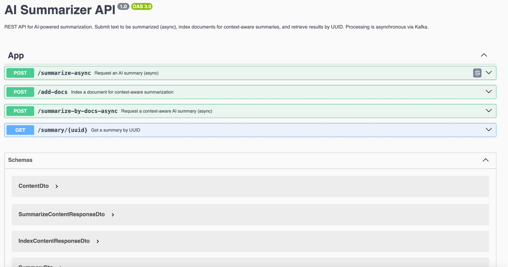

# AI-Summarizer

A lightweight Node.js backend that provides a **REST API for AI-powered text summarization**. You can request summaries asynchronously, index documents for context-aware (RAG-style) summarization, and retrieve results by UUID. Processing runs asynchronously via Kafka.

**Author:** [saarziv](https://github.com/saarziv)

---

## What this app does

- **Summarize text** — Send text and get back a UUID; when processing is done, fetch the summary with that UUID.
- **Index documents** — Add documents that are embedded and stored so they can be used as context for later summaries.
- **Context-aware summaries** — Request a summary that uses your indexed documents as context (RAG-style).
- **Get a summary by UUID** — Retrieve a stored summary (and its metadata) by the UUID returned from a summarize endpoint.

---


## Architecture (existing)

The project is a **monorepo event-driven microservices** setup:

| Service | Role |
|--------|------|
| **summarizer-service** | Exposes the REST APIs for summaries, stores summaries and indexed context documents. |
| **ai-service** | Holds the logic for calling LLMs: Jina for embeddings, LLM for summarization (including with context). |

The microservices communicate via a **Kafka** message broker.

---

## REST APIs

The summarizer service exposes these HTTP endpoints:

| Method | Path | Description |
|--------|------|-------------|
| **POST** | `/summarize-async` | Request an AI summary (async). Send text in the body; you get a UUID back. Use `GET /summary/:uuid` to fetch the result when ready. |
| **POST** | `/add-docs` | Index a document for context-aware summarization. Body: `{ "text": "..." }`. Indexed docs are used when you call `POST /summarize-by-docs-async`. |
| **POST** | `/summarize-by-docs-async` | Request a context-aware AI summary (async). Uses your indexed documents as context. Returns a UUID; use `GET /summary/:uuid` to fetch the result. |
| **GET** | `/summary/:uuid` | Get a stored summary by UUID. Returns the full summary record (original text, summary, topics, etc.). Returns 404 if not found or not yet ready. |

Request/response bodies and all fields are described in the **Swagger (OpenAPI)** docs when the app is running (see below).

---

## API documentation (Swagger)

When the summarizer service is running locally, interactive API docs are available at:

**[Swagger UI — http://localhost:3000/api](http://localhost:3000/api)**

(Use port 3000 by default, or the `PORT` from your environment.)

Preview of the Swagger page:



---

## Run the app

To run the summarizer service (dev mode with watch):

```sh
npx nx serve summarizer-service
```

To create a production bundle:

```sh
npx nx build summarizer-service
```

To see all available targets for the project:

```sh
npx nx show project summarizer-service
```

---

<a alt="Nx logo" href="https://nx.dev" target="_blank" rel="noreferrer"></a>

✨ This workspace is built with [Nx](https://nx.dev).

[Learn more about this workspace](https://nx.dev/nx-api/node?utm_source=nx_project&amp;utm_medium=readme&amp;utm_campaign=nx_projects) or run `npx nx graph` to explore the project graph.

### Run tasks

- **Serve (dev):** `npx nx serve summarizer-service`
- **Build:** `npx nx build summarizer-service`
- **List targets:** `npx nx show project summarizer-service`

[More about running tasks &raquo;](https://nx.dev/features/run-tasks?utm_source=nx_project&utm_medium=readme&utm_campaign=nx_projects)

### Add new projects

```sh
npx nx g @nx/node:app demo
npx nx g @nx/node:lib mylib
```

[Learn more about Nx plugins &raquo;](https://nx.dev/concepts/nx-plugins?utm_source=nx_project&utm_medium=readme&utm_campaign=nx_projects)

### CI and Nx Console

- Connect to Nx Cloud: `npx nx connect`
- Generate CI workflow: `npx nx g ci-workflow`
- [Install Nx Console](https://nx.dev/getting-started/editor-setup?utm_source=nx_project&utm_medium=readme&utm_campaign=nx_projects) for your IDE

### Useful links

- [Workspace setup](https://nx.dev/nx-api/node?utm_source=nx_project&amp;utm_medium=readme&amp;utm_campaign=nx_projects)
- [Nx on CI](https://nx.dev/intro/ci-with-nx?utm_source=nx_project&utm_medium=readme&utm_campaign=nx_projects)
- [Nx plugins](https://nx.dev/concepts/nx-plugins?utm_source=nx_project&utm_medium=readme&utm_campaign=nx_projects)
- [Nx community](https://go.nx.dev/community)
